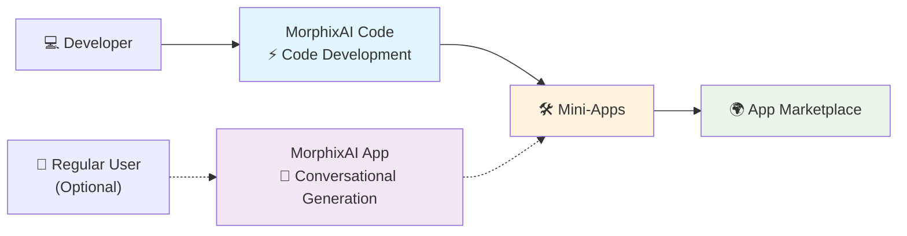

# MorphixAI Code - Open Source Development Framework

> 🇺🇸 English | [🇨🇳 中文](./docs/README_CN.md)

> 🚀 **Complete development framework for rapidly building MorphixAI mini-apps**

## 🤖 What is MorphixAI?

**MorphixAI** is an application that combines AI Q&A with user-generated custom mini-apps powered by AI. You can:

- 📱 **Direct Use** - Use various practical mini-apps shared by others
- 🛠️ **Create Your Own** - Generate exclusive mini-apps through AI conversation or code development
- 🌍 **Share with the World** - Publish your mini-apps to the official app marketplace

### 📲 Where to Experience MorphixAI?
- **iOS**: Search "MorphixAI" in the App Store
- **Android**: Download from official website https://baibian.app/
- **Web**: Online mini-app marketplace https://app-shell.focusbe.com/app-market

## 💡 What is MorphixAI Code?

This is an open-source MorphixAI mini-app development framework that provides a complete development environment, specifications, and toolchain, enabling developers to quickly create mini-apps that comply with MorphixAI platform standards.

## ⚡ Development Flow



### 🚀 Ultra-Fast Development Experience
- **💻 Primary Method** - Develop using MorphixAI Code and AI programming assistants
- **🛠️ Professional Output** - Create fully-featured professional mini-apps
- **🌍 Easy Sharing** - One-click publishing to the app marketplace for users
- **📱 Alternative Method** - Also available through conversational generation in MorphixAI App

## 🎯 Mini-App Development Features

- ⚡ **Lightning Development** - From idea to product, AI-powered ultra-fast development experience
- 👶 **Zero Barrier Development** - Even frontend beginners can quickly develop professional mini-apps
- 🚀 **Ready to Use** - Developed apps can be used directly in MorphixAI without app store approval
- 🤖 **AI Smart Assistant** - Tell AI what features you want, automatically generate complete code
- 📱 **Cross-Platform** - Develop once, run seamlessly on Web, iOS, and Android

## 🛠️ What Can Mini-Apps Do?

MorphixAI mini-apps have powerful system capabilities and AI integration:

### 📱 System Capabilities
- **Data Storage** - Local caching, persistent user data storage
- **Camera & Photos** - Take photos, record videos, access photo albums
- **File Operations** - Read and save various file formats
- **Location Services** - Get geolocation, support map functions
- **Calendar Integration** - Read/write calendar events, reminder management
- **App Notifications** - Send local notification reminders

### 🤖 AI Capabilities
- **Intelligent Q&A** - Integration with multiple AI models (GPT, Claude, etc.)
- **Image Recognition** - AI visual analysis, identify image content
- **Multimodal Interaction** - Text, image, voice multiple input methods
- **Network Requests** - Call various API interfaces

### 🌟 Application Scenarios
- **Personal Productivity Tools** - Todo lists, habit tracking, time management
- **Life Assistants** - Expense tracking, health monitoring, study notes
- **Creative Tools** - Image processing, copywriting generation, design assistants
- **Business Applications** - Data analysis, report generation, customer management


## 🚀 Mini-App Development Method

**Rapid development using AI programming assistants** - More flexible and powerful development experience:

💡 **Tip**: If you don't want to write code, you can also generate mini-apps directly through AI conversation in the MorphixAI App.

## 🚀 Quick Start

> 🎯 **Designed for zero-experience users, just follow the steps to succeed!**

### Step 1: Environment Setup

<details>
<summary><strong>📋 Install Required Tools (Click to Expand)</strong></summary>

#### 🔧 Install Node.js
Check if already installed by running this command in terminal:
```bash
node --version
```

- ✅ If it shows version number (like `v18.17.0`), it's installed
- ❌ If it shows "command not found", you need to install:

**Installation Steps:**
1. Visit: https://nodejs.org
2. Download and install LTS version (recommended)
3. Restart terminal after installation

#### 💻 Install Git (Optional but recommended)
Check if already installed by running this command in terminal:
```bash
git --version
```

- ✅ If it shows version number, it's installed
- ❌ If it shows "command not found", you need to install:

**Installation Steps:**
- **Windows**: Visit https://git-scm.com/ to download and install
- **Mac**: Usually pre-installed, or run `xcode-select --install`
- **Linux**: Run `sudo apt install git` (Ubuntu/Debian)

</details>

### Step 2: Download Project to Computer

```bash
git clone https://github.com/morphixai/morphixai-code.git
cd morphixai-code
```

### Step 3: Install Project Dependencies
Run in terminal:
```bash
npm install
```
⏳ Wait for installation to complete (may take 1-3 minutes)

### Step 4: Start Smart Development

#### 🤖 Use AI Code Editor (Recommended)

Recommended AI programming tools for the best development experience:

- **Cursor** - https://cursor.sh
- **Claude Code** - Intelligent programming assistant based on Claude AI

#### 🎉 Launch Development Environment

1. **Open project folder with code editor**

2. **Start preview server**
   ```bash
   npm run dev
   ```
   
3. **Start developing**
   - Browser will automatically open showing your app
   - Start programming in the `src/app/` folder
   - If using AI editor, you can converse with AI in Chinese to generate code


## 🤖 AI Smart Development Examples

### Natural Language Programming
Through AI conversation, you can describe requirements in natural language to develop applications:

#### Example Conversation 1: Create Component
```
You: Help me create a user profile card component with avatar, name, bio, and follow button

AI: I'll create a user profile card component for you:

1. Create src/app/components/UserProfile.jsx
2. Create src/app/styles/UserProfile.module.css
3. Use modern UI components and MorphixAI specifications
4. Include responsive design and beautiful animations
```

#### Example Conversation 2: Add Functionality
```
You: Add like functionality to the user card and save to local storage

AI: I'll add like functionality to the user card:

1. Use useState to manage like state
2. Integrate StorageAPI for local storage
3. Add like animation effects
4. Include error handling
```

#### Example Conversation 3: Style Adjustments
```
You: Make the card more modern, add shadow effects and rounded corners

AI: I'll optimize the card styling:

1. Update CSS Module styles
2. Add modern shadow effects
3. Optimize border radius and spacing
4. Ensure mobile adaptation
```

### AI Auto-Generated Code Features

✅ **Professional Code** - Automatically generate high-quality code that meets industry standards
✅ **Mobile Optimization** - Automatically adapt to various screen sizes and devices
✅ **Smart Error Handling** - Automatically add exception handling and user prompts
✅ **Performance Optimization** - Automatically apply best practices for smooth app performance
✅ **Security & Reliability** - Automatically add data validation and security checks

---

## ❓ Frequently Asked Questions

### 🤔 I don't know programming at all, can I use this?
**Absolutely!** This project is specifically designed for zero-experience users:
- 📝 Converse with AI in natural language, no need to write code
- 🤖 AI will automatically generate all required code
- 📱 Generated apps can be used directly on mobile devices


### 📱 How do I share my mini-apps with others?

#### 🌍 Publish to Official App Marketplace (Recommended)
1. **After development**: Ensure mini-app functions properly
2. **Submit for review**: Send mini-app information via email to contact@baibian.app
3. **Provide information**:
   - App ID (unique mini-app identifier)
   - Brief feature description
   - Usage scenario description
4. **After approval**: Mini-app will be displayed in MorphixAI app marketplace for all users

#### 👥 Private Sharing
1. **Local running**: Mini-app runs on your computer
2. **Code sharing**: Compress code folder and send to friends
3. **Friend usage**: Friends follow same steps to run on their computers

#### 🎯 App Marketplace Advantages
- **Global Users**: Tens of thousands of users can discover and use your mini-apps
- **No Installation Required**: Users use directly in MorphixAI without downloading
- **Cross-Platform**: Automatically supports Web, iOS, and Android platforms

### 💰 Pricing Information

#### 🆓 Free Usage
- **Basic AI Models** - Free use of basic AI functionality
- **Mini-App Usage** - Self-developed or shared mini-apps are completely free
- **App Marketplace** - Browse, download, and use mini-apps completely free

#### 💎 Paid Services
- **Advanced AI Models** - Claude, GPT-4, and other advanced models charged by usage
- **Transparent Pricing** - Pricing consistent with OpenRouter, charged by tokens
- **Pay-as-You-Use** - Only pay for AI functionality actually used

### 🔧 How to Get Help?

- 📚 **View Developer Documentation**: [DEVELOPER.md](./DEVELOPER.md)
- 🌐 **Official Documentation**: [MorphixAI Development Specification](https://app-shell.focusbe.com/docs/app-development-specification.md)
- 💬 **Community Support**: Ask questions in GitHub Issues
- 🤖 **AI Assistant**: Ask AI directly in the editor!
- 📧 **Official Email**: contact@baibian.app

---


### 📖 More Resources

- **Claude Code Usage Guide** - [CLAUDE-CODE-SETUP.md](./CLAUDE-CODE-SETUP.md) (For Claude Code users)
- **Developer Documentation** - [DEVELOPER.md](./DEVELOPER.md) (For technical personnel)
- **Complete Development Specification** - [CLAUDE.md](./CLAUDE.md) (AI programming specification)
- **Project Technical Documentation** - [docs/technical/project-overview.md](./docs/technical/project-overview.md)
- **Development Guidelines** - [docs/requirements/development-guidelines.md](./docs/requirements/development-guidelines.md)