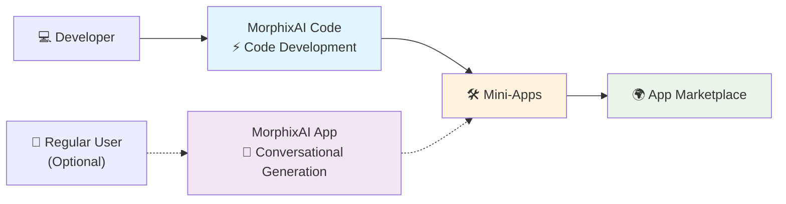

# MorphixAI Code - Open Source Development Framework

> 🇺🇸 English | [🇨🇳 中文](./docs/README_CN.md)

> **Complete development framework for rapidly building MorphixAI mini-apps**

### 📲 Where to Experience MorphixAI?
- **iOS**: Search "MorphixAI" in the App Store
- **Android**: Download from the [official website](https://baibian.app/)
- **Web**: Browse the [App Marketplace](https://app-shell.focusbe.com/app-market)

## 📚 Table of Contents
- [Quick Start](#-quick-start)
- [Troubleshooting](#-troubleshooting)
- [Project Structure](#-project-structure)
- [What is MorphixAI?](#-what-is-morphixai)
- [What is MorphixAI Code?](#-what-is-morphixai-code)
- [Development Flow](#-development-flow)
- [Mini-App Development Features](#-mini-app-development-features)
- [What Can Mini-Apps Do?](#-what-can-mini-apps-do)
- [AI Smart Development Examples](#-ai-smart-development-examples)
- [Publish & Share](#-publish--share)
- [Pricing](#-pricing)
- [Get Help](#-get-help)
- [More Resources](#-more-resources)
- [Contributing](#-contributing)
- [License](#-license)

## 🚀 Quick Start

> 🎯 Designed for zero-experience users — just follow the steps to succeed!

### Step 1: Environment
- Node.js: Use LTS versions (18 or 20 recommended). Check with:
  ```bash
  node --version
  ```
- Git (optional but recommended):
  ```bash
  git --version
  ```
- Supported OS: macOS, Windows, Linux

If Node.js is missing, download from the [official site](https://nodejs.org/). For Git, see [git-scm.com](https://git-scm.com/).

### Step 2: Clone
```bash
git clone https://github.com/morphixai/morphixai-code.git
cd morphixai-code
```

### Step 3: Install Dependencies
```bash
npm install
```

### Step 4: Start Development
1. Open the project with your editor
2. Start the dev server
   ```bash
   npm run dev
   ```
3. Your browser should open automatically. If not, visit `http://localhost:8812`
4. Start coding in `src/app/`

Tip: For the best AI-assisted DX, try [Cursor](https://cursor.sh).

## 🧰 Troubleshooting
- **Port already in use (8812)**: Close the process using the port, or change `server.port` in `vite.config.js`.
- **Install failures (network/permissions)**: Clear cache `npm cache clean --force`, then retry `npm install`. On macOS/Linux, try `sudo npm install` only if necessary.
- **Browser didn’t open**: Access `http://localhost:8812` manually; ensure `server.open` is true in `vite.config.js`.
- **Mermaid diagram not rendering on some viewers**: View on GitHub or a Markdown tool that supports Mermaid.

## 🗂 Project Structure
```
src/
  app/                # Your mini-app source (start here)
  _dev/               # Dev shell, utils, examples, config
public/               # Static assets
scripts/              # Dev helpers (watch, restore, id generation)
vite.config.js        # Dev server config (port 8812 by default)
```

## 🤖 What is MorphixAI?

**MorphixAI** combines AI Q&A with user-generated mini-apps. You can:
- **Direct Use**: Use practical mini-apps shared by others
- **Create Your Own**: Generate mini-apps via AI conversation or code
- **Share with the World**: Publish to the official app marketplace

## 💡 What is MorphixAI Code?

An open-source development framework offering environment, specifications, and toolchain to quickly build mini-apps that conform to MorphixAI standards.

## ⚡ Development Flow



## 🚀 Ultra-Fast Development Experience
- **Primary Method**: Build with MorphixAI Code and AI assistants
- **Professional Output**: Full-featured mini-apps
- **Easy Sharing**: One-click publishing to the marketplace
- **Alternative**: Conversational generation in the MorphixAI App

## 🎯 Mini-App Development Features
- **Lightning Development**: AI-powered speed from idea to product
- **Zero Barrier**: Frontend beginners can ship professional apps
- **Ready to Use**: No app-store approval needed in MorphixAI
- **AI Smart Assistant**: Describe features, get complete code
- **Cross-Platform**: Web, iOS, and Android

## 🛠️ What Can Mini-Apps Do?

### 📱 System Capabilities
- Data Storage
- Camera & Photos
- File Operations
- Location Services
- Calendar Integration
- Notifications

### 🤖 AI Capabilities
- Intelligent Q&A (GPT, Claude, etc.)
- Image Recognition
- Multimodal Interaction (text/image/voice)
- Network Requests

### 🌟 Application Scenarios
- Personal Productivity, Life Assistants, Creative Tools, Business Apps

## 🤖 AI Smart Development Examples

Describe requirements in natural language to develop apps.

#### Example 1: Create a Component
```
You: Create a user profile card with avatar, name, bio, and follow button.

AI: I'll create it:
1) Create src/app/components/UserProfile.jsx
2) Create src/app/styles/UserProfile.module.css
3) Use modern UI and MorphixAI specs
4) Add responsive design and animations
```

#### Example 2: Add Functionality
```
You: Add like functionality and persist to local storage.

AI: I'll add it:
1) Manage like state with useState
2) Integrate StorageAPI for persistence
3) Add like animation
4) Handle errors
```

### Auto-Generated Code Benefits
✅ Professional quality • ✅ Mobile optimization • ✅ Error handling • ✅ Performance best practices • ✅ Security checks

## 🌍 Publish & Share

### Official App Marketplace (Recommended)
1. Ensure your mini-app works properly
2. Email details to `contact@baibian.app`
3. Provide: App ID, brief feature description, usage scenarios
4. After approval, it will appear in the marketplace

### Private Sharing
1. Run locally on your computer
2. Zip and share the code folder
3. Friends follow the same steps to run

### Marketplace Advantages
- Global users can discover and use your mini-apps
- No installation required inside MorphixAI
- Cross-platform by default

## 💰 Pricing

### Free
- Basic AI models
- Use self-developed or shared mini-apps
- Browse and use marketplace apps

### Paid
- Advanced AI models (e.g., Claude, GPT-4) billed by usage
- Transparent pricing aligned with OpenRouter
- Pay only for the AI you use

## 🔧 Get Help
- Developer Docs: [DEVELOPER.md](./DEVELOPER.md)
- Official Spec: [MorphixAI Development Specification](https://app-shell.focusbe.com/docs/app-development-specification.md)
- Community: GitHub Issues
- AI Assistant: Ask directly in your editor
- Email: `contact@baibian.app`

## 📖 More Resources
- Developer Documentation — [DEVELOPER.md](./DEVELOPER.md)
- Complete Development Specification — [CLAUDE.md](./CLAUDE.md)
- Project Technical Documentation — [docs/technical/project-overview.md](./docs/technical/project-overview.md)
- Development Guidelines — [docs/requirements/development-guidelines.md](./docs/requirements/development-guidelines.md)

## 🤝 Contributing
Contributions are welcome! Please open an issue or pull request. For local development guidance, see `DEVELOPER.md`.

## 📄 License
This project is licensed under the MIT License.