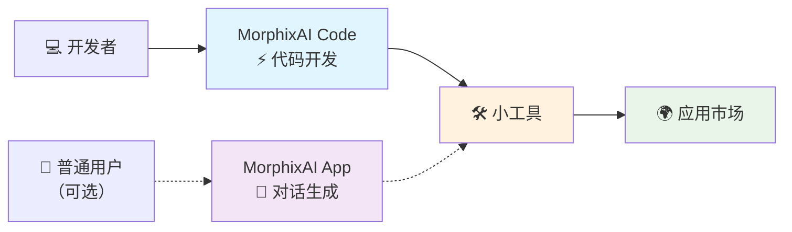

# MorphixAI Code - 开源开发框架

> [🇺🇸 English](../README.md) | 🇨🇳 中文

> 🚀 **快速开发 MorphixAI 小工具的完整开发框架**

## 🤖 什么是 MorphixAI？

**MorphixAI（中文名：百变AI助手）** 是一款集 AI 问答与用户利用 AI 生成自定义小工具于一体的应用。你可以：

- 📱 **直接使用** - 使用他人分享的各种实用小工具
- 🛠️ **自己创造** - 通过 AI 对话或代码开发生成专属小工具  
- 🌍 **分享给世界** - 将你的小工具发布到官方应用市场

### 📲 在哪里体验 MorphixAI？
- **iOS**：App Store 搜索 "百变AI助手（MorphixAI）"
- **Android**：官方网站下载 https://baibian.app/
- **Web**：在线体验小工具市场 https://app-shell.focusbe.com/app-market

## 💡 MorphixAI Code 是什么？

这是一个开源的 MorphixAI 小工具开发框架，提供完整的开发环境、规范和工具链，让开发者能够快速创建符合 MorphixAI 平台规范的小工具。

## ⚡ 开发流程



### 🚀 超快开发体验
- **💻 主要方式** - 使用 MorphixAI Code 和 AI 编程助手开发
- **🛠️ 专业输出** - 创建功能完整的专业级小工具
- **🌍 轻松分享** - 一键发布到应用市场供用户使用
- **📱 备选方式** - 也可在 MorphixAI App 内通过对话快速生成

## 🎯 小工具开发特点

- ⚡ **极速开发** - 从创意到成品，AI 助力超快开发体验
- 👶 **零门槛开发** - 前端小白也能快速开发专业级小工具
- 🚀 **即开即用** - 开发完成即可在 MorphixAI 中直接使用，无需应用商店审核
- 🤖 **AI 智能助手** - 告诉 AI 你想要什么功能，自动生成完整代码
- 📱 **跨平台运行** - 一次开发，在 Web、iOS、Android 三端无缝运行

## 🛠️ 小工具能做什么？

MorphixAI 小工具拥有强大的系统能力和 AI 集成：

### 📱 系统能力
- **数据存储** - 本地缓存，持久化保存用户数据
- **相机相册** - 拍照、录像、访问相册图片
- **文件操作** - 读取与保存各种格式文件
- **定位服务** - 获取地理位置，支持地图功能
- **日历集成** - 读写日历事件，提醒管理
- **应用通知** - 发送本地通知提醒

### 🤖 AI 能力
- **智能问答** - 集成多种 AI 模型（GPT、Claude 等）
- **图像识别** - AI 视觉分析，识别图片内容
- **多模态交互** - 文字、图片、语音多种输入方式
- **网络请求** - 调用各种 API 接口

### 🌟 应用场景
- **个人效率工具** - 待办事项、习惯追踪、时间管理
- **生活助手** - 记账工具、健康监测、学习笔记
- **创意工具** - 图片处理、文案生成、设计助手
- **商务应用** - 数据分析、报表生成、客户管理


## 🚀 小工具开发方式

**使用 AI 编程助手快速开发** - 更灵活、更强大的开发体验：

💡 **提示**：如果你不想写代码，也可以直接在 MorphixAI App 内通过 AI 对话生成小工具。

## 🚀 快速开始

> 🎯 **专为零基础用户设计，跟着步骤走就能成功！**

### 第一步：环境准备

<details>
<summary><strong>📋 安装必要工具（点击展开）</strong></summary>

#### 🔧 安装 Node.js
在终端中输入以下命令检查是否已安装：
```bash
node --version
```

- ✅ 如果显示版本号（如 `v18.17.0`），说明已安装
- ❌ 如果显示"命令不存在"，需要安装：

**安装步骤：**
1. 访问：https://nodejs.org
2. 下载并安装 LTS 版本（推荐版本）
3. 安装完成后重启终端

#### 💻 安装 Git（可选，但推荐）
在终端中输入以下命令检查是否已安装：
```bash
git --version
```

- ✅ 如果显示版本号，说明已安装
- ❌ 如果显示"命令不存在"，需要安装：

**安装步骤：**
- **Windows**：访问 https://git-scm.com/ 下载安装
- **Mac**：通常已预装，或运行 `xcode-select --install`
- **Linux**：运行 `sudo apt install git`（Ubuntu/Debian）

</details>

### 第二步：下载项目到电脑

```bash
git clone https://github.com/morphixai/morphixai-code.git
cd morphixai-code
```

### 第三步：安装项目依赖
在终端中输入：
```bash
npm install
```
⏳ 等待安装完成（可能需要 1-3 分钟）

### 第四步：开始智能开发

#### 🤖 使用 AI 代码编辑器（推荐）

推荐使用以下 AI 编程工具来获得最佳开发体验：

- **Cursor** - https://cursor.sh
- **Claude Code** - 基于 Claude AI 的智能编程助手

#### 🎉 启动开发环境

1. **用代码编辑器打开项目文件夹**

2. **启动预览服务器**
   ```bash
   npm run dev
   ```
   
3. **开始开发**
   - 浏览器会自动打开显示你的应用
   - 在 `src/app/` 文件夹中开始编程
   - 如果使用 AI 编辑器，可以用中文与 AI 对话来生成代码


## 🤖 AI 智能开发示例

### 自然语言编程
通过与 AI 对话，你可以用中文描述需求来开发应用：

#### 示例对话 1：创建组件
```
你：帮我创建一个用户资料卡片组件，包含头像、姓名、简介和关注按钮

AI：我来为你创建一个用户资料卡片组件：

1. 创建 src/app/components/UserProfile.jsx
2. 创建 src/app/styles/UserProfile.module.css
3. 使用现代化 UI 组件和 MorphixAI 规范
4. 包含响应式设计和精美动画
```

#### 示例对话 2：添加功能
```
你：在用户卡片中添加点赞功能，并保存到本地存储

AI：我来为用户卡片添加点赞功能：

1. 使用 useState 管理点赞状态
2. 集成 StorageAPI 进行本地存储
3. 添加点赞动画效果
4. 包含错误处理
```

#### 示例对话 3：样式调整
```
你：让卡片更加现代化，添加阴影效果和圆角

AI：我来优化卡片样式：

1. 更新 CSS Module 样式
2. 添加现代化阴影效果
3. 优化圆角和间距
4. 确保移动端适配
```

### AI 自动生成的代码特点

✅ **专业级代码** - 自动生成符合行业标准的高质量代码
✅ **移动端优化** - 自动适配各种屏幕尺寸和设备
✅ **智能错误处理** - 自动添加异常处理和用户提示
✅ **性能优化** - 自动应用最佳实践，确保应用流畅运行
✅ **安全可靠** - 自动添加数据验证和安全检查

---

## ❓ 常见问题解答

### 🤔 我完全不会编程，能用这个吗？
**当然可以！** 这个项目就是专门为零基础用户设计的：
- 📝 用中文和 AI 对话，不需要写代码
- 🤖 AI 会自动生成所有需要的代码
- 📱 生成的应用可以直接在手机上使用


### 📱 我的小工具如何分享给别人？

#### 🌍 发布到官方应用市场（推荐）
1. **开发完成后**：确保小工具功能正常
2. **提交审核**：将小工具信息发送邮件到 contact@baibian.app
3. **提供信息**：
   - App ID（小工具唯一标识）
   - 功能简要说明
   - 使用场景描述
4. **审核通过**：小工具将在 MorphixAI 应用市场展示，所有用户都能使用

#### 👥 私下分享
1. **本地运行**：小工具在你电脑上运行
2. **代码分享**：把代码文件夹压缩发给朋友
3. **朋友使用**：朋友按相同步骤在自己电脑上运行

#### 🎯 应用市场优势
- **全球用户**：数万用户可以发现和使用你的小工具
- **无需安装**：用户在 MorphixAI 中直接使用，无需下载安装
- **跨平台**：自动支持 Web、iOS、Android 三个平台

### 💰 收费说明

#### 🆓 免费使用
- **基础 AI 模型** - 免费使用基础 AI 功能
- **小工具使用** - 自己开发或他人分享的小工具完全免费
- **应用市场** - 浏览、下载、使用小工具完全免费

#### 💎 付费服务
- **高级 AI 模型** - Claude、GPT-4 等高级模型按使用量计费
- **定价透明** - 价格与 OpenRouter 保持一致，按 tokens 计费
- **按需付费** - 只为实际使用的 AI 功能付费

### 🔧 如何获得帮助？

- 📚 **查看开发者文档**：[DEVELOPER.md](../DEVELOPER.md)
- 🌐 **官方文档**：[MorphixAI 开发规范](https://app-shell.focusbe.com/docs/app-development-specification.md)
- 💬 **社区支持**：在 GitHub Issues 中提问
- 🤖 **AI 助手**：直接在编辑器中问 AI！
- 📧 **官方邮箱**：contact@baibian.app

---


### 📖 更多资源

- **Claude Code 使用指南** - [CLAUDE-CODE-SETUP.md](../CLAUDE-CODE-SETUP.md) （Claude Code 用户专用）
- **开发者文档** - [DEVELOPER.md](../DEVELOPER.md) （技术人员专用）
- **完整开发规范** - [CLAUDE.md](../CLAUDE.md) （AI 编程规范）
- **项目技术文档** - [technical/project-overview.md](./technical/project-overview.md)
- **开发指南** - [requirements/development-guidelines.md](./requirements/development-guidelines.md)
