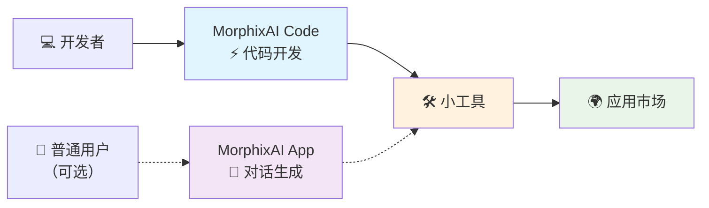

# MorphixAI Code — 快速开发、可直接使用的小工具应用框架

> [🇺🇸 English](../README.md) | 🇨🇳 中文

> **快速构建并上线可直接使用的小工具应用**

### 📲 在哪里体验 MorphixAI？
- **iOS**：App Store 搜索 “百变AI助手（MorphixAI）”
- **Android**：前往[官方网站](https://baibian.app/)下载
- **Web**：打开[小工具市场](https://app-shell.focusbe.com/app-market)

## 📚 目录
- [快速开始](#-快速开始)
- [故障排查](#-故障排查)
- [项目结构](#-项目结构)
- [什么是 MorphixAI？](#-什么是-morphixai)
- [MorphixAI Code 是什么？](#-morphixai-code-是什么)
- [开发流程](#-开发流程)
- [小工具开发特点](#-小工具开发特点)
- [小工具能做什么？](#-小工具能做什么)
- [AI 智能开发示例](#-ai-智能开发示例)
- [发布与分享](#-发布与分享)
- [收费说明](#-收费说明)
- [如何获得帮助](#-如何获得帮助)
- [更多资源](#-更多资源)
- [参与贡献](#-参与贡献)
- [许可证](#-许可证)

## 🚀 快速开始

> 🎯 专为零基础用户设计，按步骤即可运行。

### 第一步：环境准备
- Node.js：建议使用 LTS 版本（18 或 20）。检查：
  ```bash
  node --version
  ```
- Git（可选）：
  ```bash
  git --version
  ```
- 支持系统：macOS / Windows / Linux

如未安装 Node.js，请访问[Node.js 官方网站](https://nodejs.org/)。Git 可参考 [git-scm.com](https://git-scm.com/)。

### 第二步：下载项目
```bash
git clone https://github.com/morphixai/morphixai-code.git
cd morphixai-code
```

### 第三步：安装依赖
```bash
npm install
```

### 第四步：启动开发
1. 用你喜欢的编辑器打开项目
2. 启动开发服务器
   ```bash
   npm run dev
   ```
3. 浏览器会自动打开；如未打开，访问 `http://localhost:8812`
4. 从 `src/app/` 开始编写你的代码

提示：推荐使用 [Cursor](https://cursor.sh) 获得更好的 AI 编程体验。

## 🧰 故障排查
- **端口被占用（8812）**：关闭占用该端口的进程，或在 `vite.config.js` 修改 `server.port`。
- **安装失败（网络/权限）**：执行 `npm cache clean --force` 后重试 `npm install`。macOS/Linux 必要时使用 `sudo`。
- **浏览器未自动打开**：手动访问 `http://localhost:8812`；或确保 `vite.config.js` 中 `server.open` 为 `true`。
- **Mermaid 图未渲染**：请在 GitHub 或支持 Mermaid 的 Markdown 工具中查看。

## 🗂 项目结构
```
src/
  app/                # 你的应用代码（建议从这里开始）
  _dev/               # 开发壳、工具、示例与配置
public/               # 静态资源
scripts/              # 开发辅助脚本（watch、恢复、ID 生成）
vite.config.js        # 开发服务器配置（默认端口 8812）
```

## 🤖 什么是 MorphixAI？

**MorphixAI（中文名：百变AI助手）** 集 AI 问答与用户自定义小工具于一体。你可以：
- **直接使用**：体验他人分享的各种实用小工具
- **自己创造**：通过 AI 对话或代码开发生成专属小工具
- **分享给世界**：发布到官方应用市场

## 💡 MorphixAI Code 是什么？

开源的小工具开发框架，提供完整的开发环境、规范与工具链，帮助你快速构建符合 MorphixAI 平台规范的小工具。

## ⚡ 开发流程



## 🚀 超快开发体验
- **主要方式**：使用 MorphixAI Code 与 AI 编程助手
- **专业输出**：构建功能完整的专业级小工具
- **轻松分享**：一键发布到应用市场
- **备选方式**：在 MorphixAI App 内对话生成

## 🎯 小工具开发特点
- **极速开发**：从创意到成品，AI 加速交付
- **零门槛**：前端小白也能快速上手
- **即开即用**：在 MorphixAI 内直接使用，无需商店审核
- **AI 助手**：用自然语言描述，自动生成完整代码
- **跨平台**：一次开发，Web / iOS / Android 运行

## 🛠️ 小工具能做什么？

### 📱 系统能力
- 数据存储
- 相机与相册
- 文件读写
- 定位与地图
- 日历集成
- 本地通知

### 🤖 AI 能力
- 智能问答（GPT、Claude 等）
- 图像识别
- 多模态交互（文字/图片/语音）
- 网络请求

### 🌟 应用场景
- 个人效率、生活助手、创意工具、商务应用

## 🤖 AI 智能开发示例

通过与 AI 对话，用自然语言完成开发。

#### 示例 1：创建组件
```
你：创建一个用户资料卡片组件，包含头像、姓名、简介和关注按钮。

AI：我来创建：
1) 创建 src/app/components/UserProfile.jsx
2) 创建 src/app/styles/UserProfile.module.css
3) 使用现代化 UI 与 MorphixAI 规范
4) 添加响应式与动画
```

#### 示例 2：添加功能
```
你：给用户卡片添加点赞功能，并持久化到本地存储。

AI：我来添加：
1) 使用 useState 管理点赞状态
2) 集成 StorageAPI 做持久化
3) 添加点赞动画
4) 处理异常
```

### AI 自动生成代码的优势
✅ 专业质量 • ✅ 移动端优化 • ✅ 错误处理 • ✅ 性能最佳实践 • ✅ 安全校验

## 🌍 发布与分享

### 官方应用市场（推荐）
1. 确保你的小工具功能正常
2. 将小工具信息发送到 `contact@baibian.app`
3. 提供：App ID、功能简述、使用场景
4. 审核通过后，将在应用市场展示

### 私下分享
1. 在本地运行
2. 压缩代码目录并分享给朋友
3. 对方按相同步骤运行

### 应用市场优势
- 全球用户可发现和使用你的小工具
- 在 MorphixAI 内直接使用，无需下载
- 天然跨平台

## 💰 收费说明

### 免费
- 基础 AI 模型
- 自研或他人分享的小工具使用
- 应用市场浏览与使用

### 付费
- 高级 AI 模型（如 Claude、GPT-4）按使用量计费
- 定价与 OpenRouter 保持一致（按 tokens）
- 按需付费，仅为实际调用的 AI 支付

## 🔧 如何获得帮助
- 开发者文档：[DEVELOPER.md](../DEVELOPER.md)
- 官方规范：[MorphixAI 开发规范](https://app-shell.focusbe.com/docs/app-development-specification.md)
- 社区支持：GitHub Issues
- AI 助手：在编辑器中直接提问
- 官方邮箱：`contact@baibian.app`

## 📖 更多资源
- 开发者文档 — [DEVELOPER.md](../DEVELOPER.md)
- 完整开发规范 — [CLAUDE.md](../CLAUDE.md)
- 项目技术文档 — [technical/project-overview.md](./technical/project-overview.md)
- 开发指南 — [requirements/development-guidelines.md](./requirements/development-guidelines.md)

## 🤝 参与贡献
欢迎通过 Issue 或 Pull Request 参与贡献。开发环境搭建与本地调试请参考 `DEVELOPER.md`。

## 📄 许可证
本项目基于 MIT 许可证开源。
