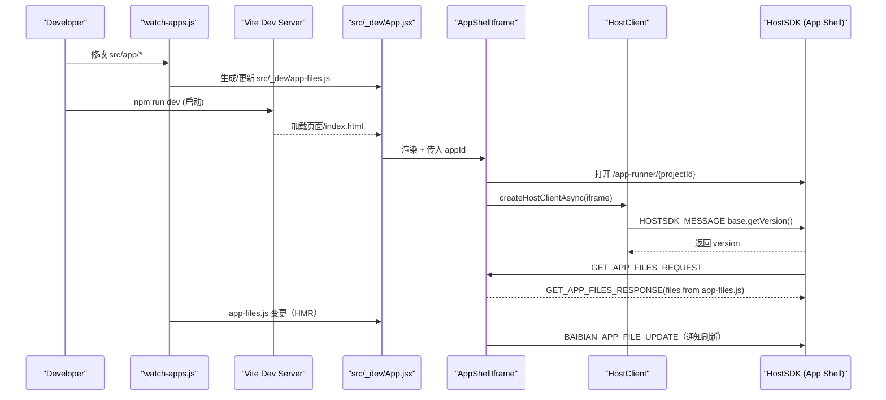

## MorphixAI Code 项目总览

### 概述（用途）
- **是什么**: 一个用于快速开发 MorphixAI 应用的前端模板与开发框架，内置 React（Ionic 组件）、Vite 开发环境、热更新与 iframe 宿主通信能力。
- **面向人群**: 前端新手到专业开发者，期望以极低门槛快速搭建可在 MorphixAI 平台运行的应用。
- **能做什么**: 本地开发 `src/app` 里的业务代码，开发时通过 `AppShellIframe` 将外部 App Shell（宿主）以 iframe 嵌入，利用 `HostClient` 与宿主进行标准化通信；提供调试面板、二维码分享、上传/更新应用的操作入口。

### 工作原理
1. **项目启动与开发服务器**
   - 运行 `npm run dev` → 启动 `scripts/dev-with-watch.js`：
     - 先运行 `scripts/watch-apps.js` 监听 `src/app/` 的文件变更，生成 `src/_dev/app-files.js`（包含 `src/app` 的完整文件快照）。
     - 再启动 Vite (`npm run dev:vite`)，端口在 `vite.config.js` 中配置为 8812。
   - `index.html` 注入 CSP 和一个 `AppShellCommunication` 简易通信管理器，并加载入口 `src/_dev/main.jsx`。

2. **开发态页面结构与渲染**
   - `src/_dev/main.jsx` 渲染 `src/_dev/App.jsx` 到 `#root`。
   - `App.jsx` 采用左右分栏（桌面）/单栏（移动）布局：
     - 左侧设备预览为 `AppShellIframe`，负责加载宿主 App Shell：
       - 预览 URL: `APP_SHELL_CONFIG.devBaseUrl/app-runner/{projectId}?t=timestamp`。
       - 通过 `window.postMessage` 与宿主通信，处理 `BAIBIAN_APP_READY`、`BAIBIAN_APP_ERROR`、`GET_APP_FILES_REQUEST` 等事件。
       - 接收宿主请求时，直接返回 `app-files.js` 中的文件内容用于“远程拉取应用源文件”。
       - 启用 HMR：当 `app-files.js` 热替换时，向 iframe 发送 `BAIBIAN_APP_FILE_UPDATE` 消息以触发宿主刷新。
     - 右侧 `DevControlPanel` 调试面板：
       - 展示 `HostClient` 连接状态。
       - 生成并展示预览链接与二维码（支持分享/复制）。
       - 通过多种兼容调用尝试触发宿主的上传/更新能力（`dev.openUploadDialog` / `dev.uploadApp` / `app.upload`）。

3. **项目 ID 与预览 URL**
   - `scripts/generate-project-id.js` 在 `postinstall` 或手动运行 `npm run generate-id` 时生成 `src/_dev/project-config.json`，写入 `projectId`。
   - 运行态由 `getProjectIdWithWarning()` 读取 `project-config.json`，若缺失则用占位 ID 并提示用户生成。

4. **宿主通信与 HostClient**
   - `src/_dev/lib/HostClient.ts` 定义标准协议：
     - 事件名 `HOST_SDK_EVENT = 'HOSTSDK_MESSAGE'`；
     - 请求/响应结构体 `HostRequest`/`HostResponse`；
     - 30s 超时、请求队列、按 `requestId` 匹配回包。
   - `createHostClientAsync(iframe)` 在 `iframe` onLoad 后初始化，尝试通过调用 `base.getVersion()` 与宿主握手；成功后以 Proxy 方式暴露模块化能力（如 `auth.getUserInfo()`、`dev.uploadApp()`）。
   - `AppShellIframe` 在初始化成功后通过 `onHostClientReady(client)` 向上游暴露客户端；外层 `App.jsx` 将其传给 `DevControlPanel` 以支持上传/分享操作。

5. **应用代码的来源与热更新**
   - 业务代码位于 `src/app/`（示例：`app.jsx`、`components/Welcome.jsx`、样式等）。
   - 监听器将 `src/app/` 打包为一个纯对象写入 `src/_dev/app-files.js`，开发态由宿主通过 `GET_APP_FILES_REQUEST` 拉取；当本地文件变化时，HMR 会更新该对象并通知宿主刷新。

### 模块与目录关系
- **`src/app/`（业务代码）**
  - 开发者编写的实际应用代码（在移动端宿主中运行）。
  - 示例文件：`app.jsx`、`components/Welcome.jsx`、`styles/*`。

- **`src/_dev/`（开发外壳/预览层）**
  - `App.jsx`：开发主界面，组合 `AppShellIframe` + `DevControlPanel`，读取 `projectId` 并展示。
  - `components/AppShellIframe.jsx`：
    - 用于在浏览器加载宿主 App Shell 的 iframe 容器；
    - 管理与宿主间的消息通信、HostClient 生命周期；
    - 响应宿主对应用文件的请求，返回由 `app-files.js` 生成的文件快照；
    - 触发宿主刷新以实现热更新。
  - `components/DevControlPanel.jsx`：
    - 连接状态指示；
    - 生成预览链接与二维码；
    - 触发宿主上传/更新应用。
  - `lib/HostClient.ts`：标准化的 iframe 客户端 SDK，实现请求/响应协议、超时、模块代理；
  - `utils/projectId.js`：读取 `src/_dev/project-config.json` 获取 `projectId`。
  - `config/appShellConfig.js`：配置宿主基础地址（正式与开发）。
  - `app-files.js`：由监听器生成的 `src/app/` 文件快照，供宿主拉取与热更新。

- **`scripts/`（开发工具链）**
  - `dev-with-watch.js`：并行启动文件监听与 Vite。
  - `watch-apps.js`：监听 `src/app/`，生成 `src/_dev/app-files.js`。
  - `generate-project-id.js`：生成 `src/_dev/project-config.json`，写入 `projectId`。
  - `restore-apps.js`：从 `public/app-files.json` 还原应用文件到 `src/app/`（备选工具）。

- **根配置**
  - `vite.config.js`：React 与 Tailwind 插件、端口、CSS Modules、别名（`@` 指向 `src/_dev`）。
  - `index.html`：CSP、允许的 `frame-src`/`connect-src` 白名单、通信初始化代码。
  - `package.json`：脚本、依赖、`morphixai` 元信息（框架类型、入口文件、最低 App Runner 版本）。

### 关键交互流程
1. 启动开发 → 监听 `src/app/*` → 生成 `app-files.js` → 启动 Vite。
2. 页面加载 `App.jsx` → 渲染 `AppShellIframe`（以 `projectId` 拼接预览 URL）。
3. `iframe` 加载宿主 → `AppShellIframe` 初始化 `HostClient` 并握手（`base.getVersion`）。
4. 宿主请求 `GET_APP_FILES_REQUEST` → `AppShellIframe` 返回 `app-files`；宿主运行业务代码。
5. 本地改动触发 HMR → 更新 `app-files.js` → `AppShellIframe` 发送 `BAIBIAN_APP_FILE_UPDATE` → 宿主刷新应用。

### 模块协作时序图

### 安全与约束
- **内容安全策略（CSP）**：`index.html` 指定允许的 `frame-src` 与 `connect-src`，限制 iframe 与网络请求来源。
- **消息来源校验**：`index.html` 的 `AppShellCommunication` 过滤 `event.origin`，`HostClient` 也支持 `targetOrigin` 配置。
- **沙箱**：iframe 使用 `sandbox="allow-scripts allow-same-origin allow-forms allow-popups allow-modals"`，并显式 `allow` 使用的设备能力。

### 运行方式
- 安装依赖：`npm install`
- 生成项目 ID（若未生成）：`npm run generate-id`
- 启动开发：`npm run dev`
- 访问：`http://localhost:8812`（Vite 默认已自动打开）

### 术语对照
- **宿主（Host / App Shell）**：承载并运行应用的外部容器（通过 iframe 加载）。
- **HostClient**：本项目提供的 iframe 客户端 SDK，用于与宿主通信。
- **App Runner**：宿主侧用于运行具体应用的运行时页面（路径 `/app-runner/{appId}`）。
- **应用文件快照（app-files）**：将 `src/app` 的文件树打包为对象，供宿主在开发态直接拉取执行。

### 当前示例应用
- `src/app/app.jsx` + `components/Welcome.jsx` + 样式：提供一个演示页，展示整体开发-预览-通信闭环。

### 后续可扩展方向
- 扩展 `HostClient` 模块能力（如设备 API、文件存储、通知等）。
- 加入更完善的能力协商（`getCapabilities()` 从宿主动态拉取）。
- 丰富 `DevControlPanel` 的调试工具（日志查看、状态面板、性能指标）。

